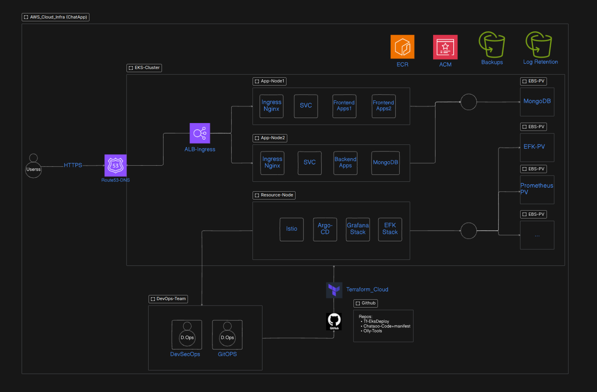
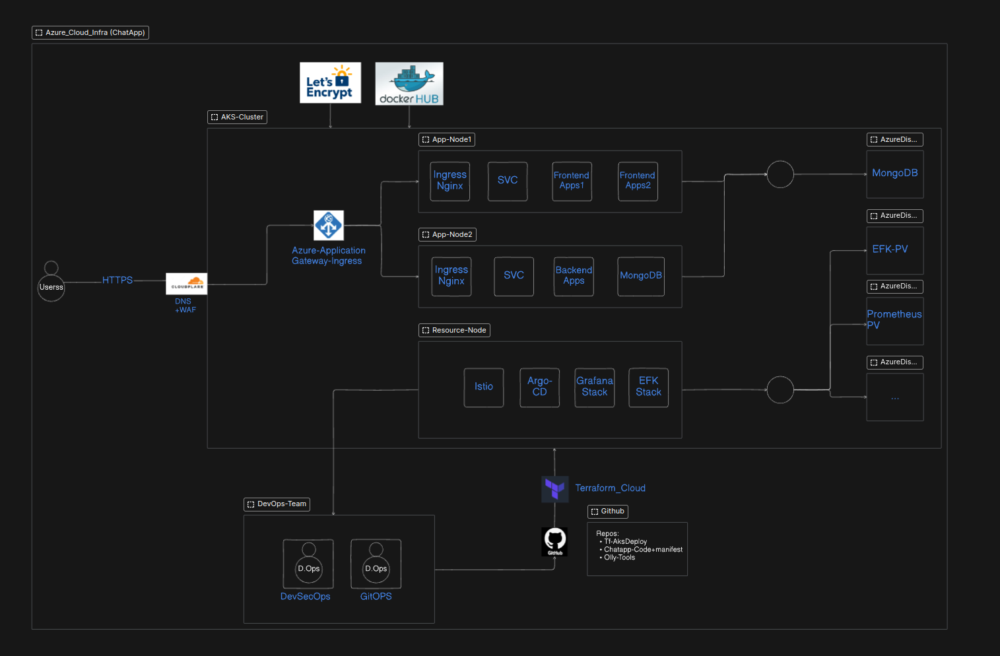

# ChatApp Enterprise-Level Deployment

Welcome to **ChatApp**, a production-grade, enterprise-level chat application built with cutting-edge DevSecOps practices. This repository encapsulates the entire lifecycle of the application, from development to deployment, across multiple cloud environments. Whether you're deploying on **Azure AKS**, **AWS EKS**, or **DigitalOcean Kubernetes**, this project has you covered with an optimized, scalable, and secure infrastructure.

---

## 🚀 **Overview**
**ChatApp** is a websocket-based real-time chat application with a **React** frontend and a **Node.js** backend. The app is built for seamless, low-latency communication and employs modern tools and techniques to deliver a production-ready environment.

## 📊 **Infrastructure Diagrams**
### AWS Infrastructure


### Azure Infrastructure


---

## 🛠 **Tech Stack**
### **Frontend**
- Framework: **React**
- Styling: **TailwindCSS**
- Build Tools: **Vite**

### **Backend**
- Runtime: **Node.js**
- Framework: **Express.js**
- Database: **MongoDB** (with Persistent Volumes and Claims)

### **Infrastructure and Tools**
- **Kubernetes (K8s):** AKS, EKS, DigitalOcean Kubernetes
- **CI/CD:** GitHub Actions, Jenkins, GitOps with Argo CD
- **Docker:** Containerization of frontend and backend
- **Terraform Cloud:** Infrastructure as Code (IaC)
- **Ingress Controllers:** 
  - **AWS ALB**
  - **Azure Application Gateway**
  - **NGINX**
  - **Kubernetes API Gateway**
- **Monitoring & Logging:** Grafana, Prometheus, Loki, EFK stack (ElasticSearch, Fluentd, Kibana)
- **Certificates:** Let’s Encrypt, AWS ACM
- **Security:** WAF, ConfigMaps, Secrets
- **Storage:** S3 Bucket, Persistent Volumes (PV) with EBS and Azure Disk
- **Networking:** Route 53, Cloudflare
- **Registry:** DockerHub, Elastic Container Registry (ECR)

---

## 📂 **Project Structure**

```bash
.
├── chatapp-backend            # Backend application
├── chatapp-frontend           # Frontend application
├── kubernetes                 # Kubernetes manifests for AKS, EKS, and DigitalOcean
├── other-apps                 # Examples and additional tools
├── sonar-project.properties   # Code quality configuration for SonarQube
├── commit.sh                  # Helper script for managing commits
└── README.md                  # You are here!
```

### **Kubernetes Directory**

```bash
kubernetes/
├── AKS-Deploy-Manifests
│   ├── azure-ag-ingress.yaml
│   ├── backend-deployment.yaml
│   ├── configmap.yaml
│   ├── frontend-app.yaml
│   ├── mongo-db-sec.yaml
│   ├── namespace.yaml
│   └── secret.yaml
├── DigitalOcean-Manifests
│   ├── b-chatapp.yaml
│   ├── b-lb-chatapp.yaml
│   ├── f-chatapp.yaml
│   ├── f-lb-chatapp.yaml
│   ├── svc-nodeport-b.yaml
│   └── svc-nodeport-f.yaml
├── EKS-Manifests
│   ├── aws-alb-ingress.yaml
│   ├── backend-deployment.yaml
│   ├── configmap.yaml
│   ├── frontend-app.yaml
│   ├── mongo-db-sec.yaml
│   ├── namespace.yaml
│   └── secret.yaml
└── README.md
```

---


## 💡 **What You Get in This Project** `Features`

- **Multi-Cloud Deployment:**  
  Easily deploy on **AWS EKS**, **Azure AKS**, or **DigitalOcean Kubernetes**, optimized for platform-specific capabilities like **AWS ALB Ingress** and **Azure Application Gateway**.

- **Scalable Architecture:**  
  Supports **Horizontal Pod Autoscaling (HPA)** for traffic and resource scalability, and integrates load balancers for efficient traffic distribution.

- **Security Best Practices:**  
  Implements **ConfigMaps** and **Secrets** for secure data handling, **WAF** for application protection, and **TLS/SSL Certificates** using **Let’s Encrypt** and **AWS ACM**.

- **Real-Time Monitoring:**  
  Integrated with **Grafana Dashboards** for visualization, **Prometheus Metrics** for KPI monitoring, and **Loki** for centralized real-time log querying.

- **Centralized Logging:**  
  Features an **EFK Stack (ElasticSearch, Fluentd, Kibana)** for centralized log management and visualization, with long-term storage backed by **AWS S3** or **Azure Blob Storage**.

- **Persistent Data Storage:**  
  Ensures database persistence with **MongoDB** on **Persistent Volumes** backed by **AWS EBS** and **Azure Disk**, and retains logs and metrics using cloud storage solutions.

- **Automated Deployments:**  
  Simplifies deployment and resource management with **Helm Charts** and leverages **Argo CD** for GitOps-driven automation.

- **CI/CD Pipelines:**  
  Automates the build, test, and deployment workflows using **GitHub Actions** and **Jenkins**, ensuring reliable and efficient delivery.

- **Networking and DNS Management:**  
  Utilizes **Route 53** and **Cloudflare** for DNS management and supports multiple ingress options such as **NGINX Ingress**, **AWS ALB**, and **Azure Application Gateway**.

- **Disaster Recovery:**  
  Implements secure backups for critical resources like **MongoDB** and application logs, stored in **S3 Buckets** or **Azure Storage**, ensuring high availability and fault tolerance.

- **DevSecOps Integration:**  
  Features tools like **SonarQube** for continuous code quality checks and **Trivy Scans** for container image vulnerability analysis.

- **Observability:**  
  Configures **Prometheus Alertmanager** and **Grafana Alerts** for real-time notifications and integrates distributed tracing for detailed request flow analysis.

- **Istio Service Mesh:**  
  Provides advanced traffic management, secure service-to-service communication, observability, and policy enforcement within Kubernetes clusters.

- **Kubernetes Dashboard:**  
  Offers a web-based UI to monitor and manage workloads, nodes, and cluster health.

- **K9s:**  
  A terminal-based UI for interacting with Kubernetes clusters, simplifying resource management and troubleshooting.

- **Cert-Manager:**  
  Automates the management and renewal of TLS/SSL certificates for Kubernetes resources.

---

## 🚀 **Getting Started**

### **1. Prerequisites**
- **Docker** installed on your machine
- Kubernetes cluster (AKS/EKS/DigitalOcean) set up
- Terraform for provisioning infrastructure
- GitHub Actions configured for CI/CD

### **2. Clone the Repository**
```bash
git clone https://github.com/ahmadrazalab/ChatApp.git
cd ChatApp
```

### **3. Build Docker Images**
Navigate to the respective directories and build the Docker images for the frontend and backend:
```bash
cd chatapp-frontend
docker build -t your-frontend-image .

cd ../chatapp-backend
docker build -t your-backend-image .
```

### **4. Deploy to Kubernetes**
- Navigate to the `kubernetes` directory and choose the target environment (AKS, EKS, DigitalOcean).
- Apply the manifests:
```bash
kubectl apply -f kubernetes/<target-environment>/
```

### **5. Monitoring and Logs**
- Access Grafana dashboards for real-time insights.
- Use the EFK stack for centralized log management.

---


## 🤝 **Contributing**
We welcome contributions! Please follow these steps:
1. Fork the repository.
2. Create a new branch (`feature/your-feature`).
3. Submit a pull request.

---

## 📝 **License**
This project is licensed under the MIT License.

---

For more visit my blog [docs.ahmadraza.in](https://docs.ahmadraza.in).  
**Note:** Only give information; detailed guides are available on my blog site.